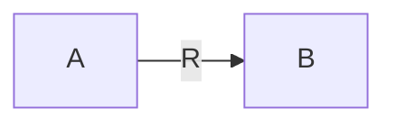
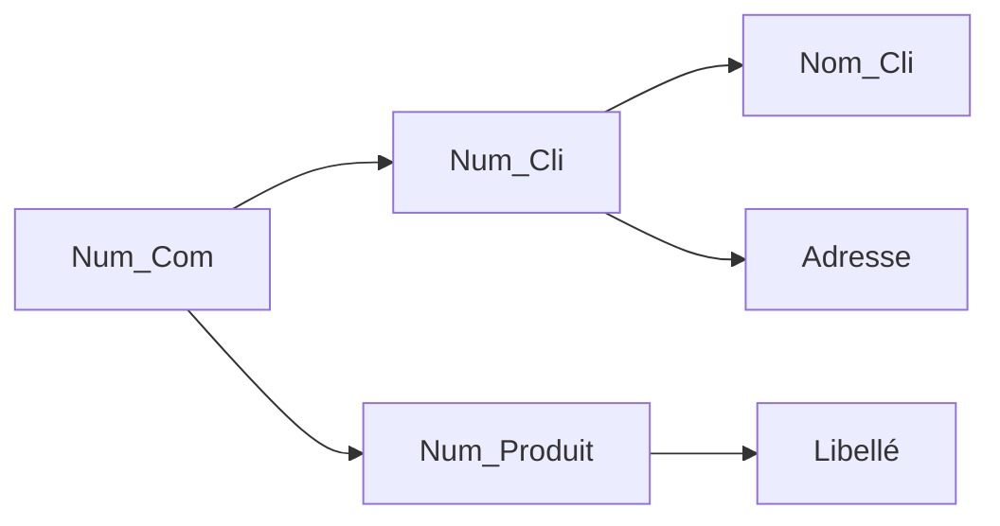
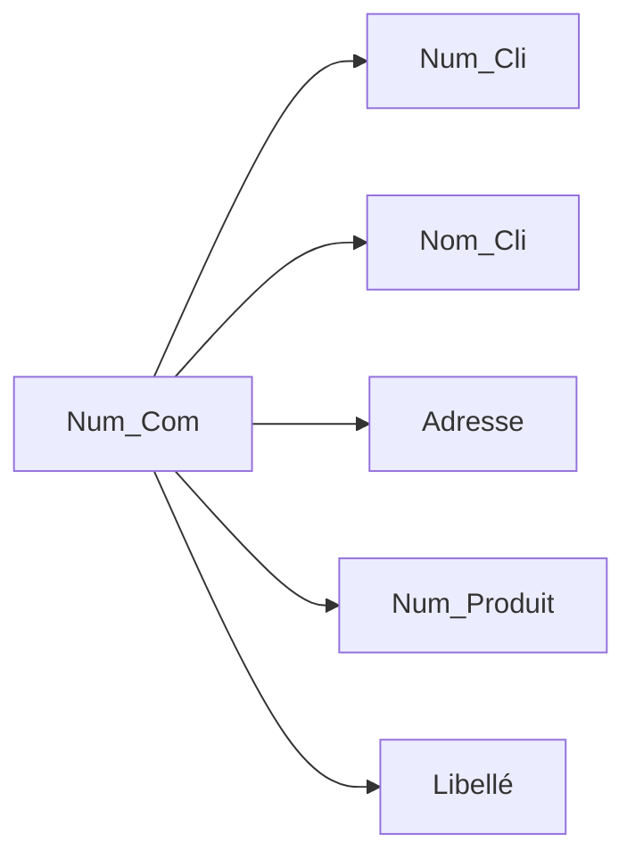

# Conception De Bases De Données Avancée

[TOC]

## 0. Introduction Et Normalisation

### Développement Traditionnel

On développe une base de donnée en 3 étapes successives : la **modélisation conceptuelle**, la **modélisation logique** et la **modélisation physique**. 

Dans le cadre d'un développement traditionnel, la redondance de l'information provoque une incohérence dans les données et est donc à proscrire. 

#### Modélisation conceptuelle

La **modélisation conceptuelle** vise à créer un **diagramme entités-relations** (E-R).  Toutes les contraintes ne peuvent pas être exprimées et doivent donc être spécifiées par des **contraintes additionnelles** qui seront consignées dans un documtent d'analyse qui accompagne le diagramme E-R.

> Les contraintes additionnelles peuvent êtres : 
>
> * Attribut A > Attribut B
> * Attribut A différent de null si Attribut B ='X'
> * La valeur de A est soit 'x', soit 'y' soit 'z'

#### Modélisation Logique

La **modélisation Logique** est la transformation du modèle conceptuel pour être utilisé par un type particulier de SGBD ( par exemple : Relationnel ). Cette étape consiste donc à résoudre certaines incompatibilités entre les couches.

> Les exemples d'incompatibilités sont par exemple : 
>
> * Héritage
> * Attributs multivalués
> * Attributs décomposables
> * Associations N-N
> * Associations comportant des attributs
> * Associations 1-N

#### Modélisation Physique

La modélisation Physique indique le choix des index, la répartition des données, ...

### La Normalisation

La **Normalisation** est une **série de transformations** appliquées à un **schéma relationnel** pour se conformer à une *forme dite normale*.

Une **forme normale** c’est un état du **schéma relationnel** qui ne contient **pas** une certaine forme **d’anomalie** (principalement liée à la redondance).

Il en existe 6 formes. Nous en aborderons 3 et la 3e devra être mise en pratique pour ce cours.

### Dépendances Fonctionnelles

Avant d'aborder les formes normales, il faut étudier le concept de dépendances fonctionnelles. 

Dans une relation (= table), un groupe d'attributs ga (group a) dépendant fonctionnellement d'un attribut a si la valeur des attributs de ga est déterminé par la valeur de a. 

> exemple: Dans une commande, il y a une dépendance fonctionnelle par rapport au numéro de produit si le prix d'un produit à toujours la même valeur. 
>
> Si le prix est fonction du produit et de la catégorie du client, alors PRIX_UN sera dépendant fonctionnellement du couple (NUM_PROD, CAT_CLI).
>
> Si le prix peut varier dans le temps et donc être différent à chaque commande, alors PRIX_UN sera dépendant fonctionnellement de NUM_COM.

Si dans la relation R, A dépend fonctionnellement de B, on peut le noter sous la forme : 

B détermine A,

A est déterminé par B

il est existe une dépendance fonctionnelle de B vers A 

#### Couverture minimale 

L'**ensemble des dépendances fonctionnelles directes** s'appelle une **couverture minimale**.

#### Transitivité

Si A -> B et B -> C alors A -> C

##### Fermeture transitive

Par transitivité, à partir des dépendances fonctionnelles directes, on peut trouver les dépendances fonctionnelles indirectes. cet ensemble est appelé une **fermeture transitive**.

	#### Dépendance Fonctionnelle Stricte

Si un client ne peut pas déménager : 

* Num_cli -> Nom_Cli, Adr_Cli

* (Num_Cli, Nom_Cli)-> Adr_Cli 
  * car à une valeur du couple(Num_Cli, Nom_Cli) ne correspond qu'une valeur de Adr_Cli

La deuxième des deux option n'est pas une dépendance stricte car  **il existe un autre déterminant de Adr_Cli** et **l'autre déterminant  fait partie du couple déterminant représenté**.

#### Dépendance multivaluée 

Il y a une dépendance fonctionnelle multivaluée si pour une valeur d'un déterminant correspond non pas une valeur du déterminé mais un sous-ensemble de valeurs, qu'il soit ordonné (**liste de valeur**) ou non ordonné (**amas de valeur**) .

> Une commande peut contenir plusieurs produits. Autrement dit, pour une valeur de NUM_COM, il y a un sous-ensemble de valeurs de NUM_PROD. La notation est alors la suivante: NUM_COM ->-> NUM_PROD. 

#### L'identifiant 

Les dépendances fonctionnelles peuvent servir à déterminer les identifiants. 

La méthode suivante peut servir  : 

1. Représentation de la couverture minimale 
2. Elimination des déterminés :curly_loop:(répétition de l'étape jusqu'à ne plus avoir de déterminé)
3. Les attributs restants sont les identifiants

Dans le schéma, il s'agit visuellement des nœuds qui ne comportent que des nœuds sortants. 

