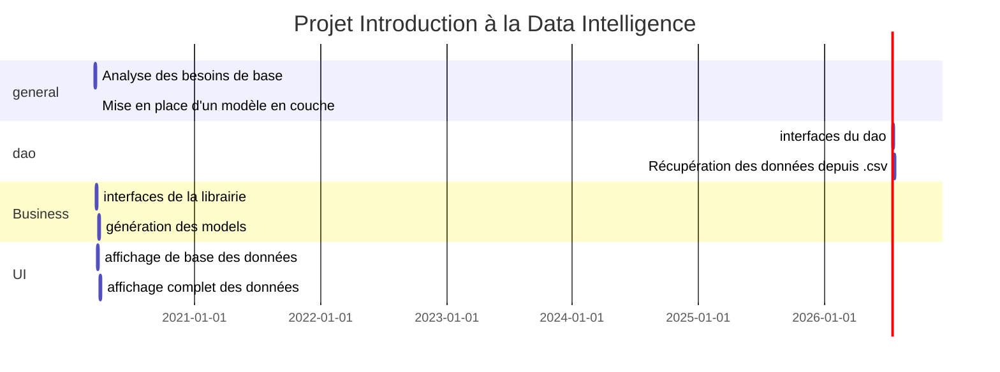
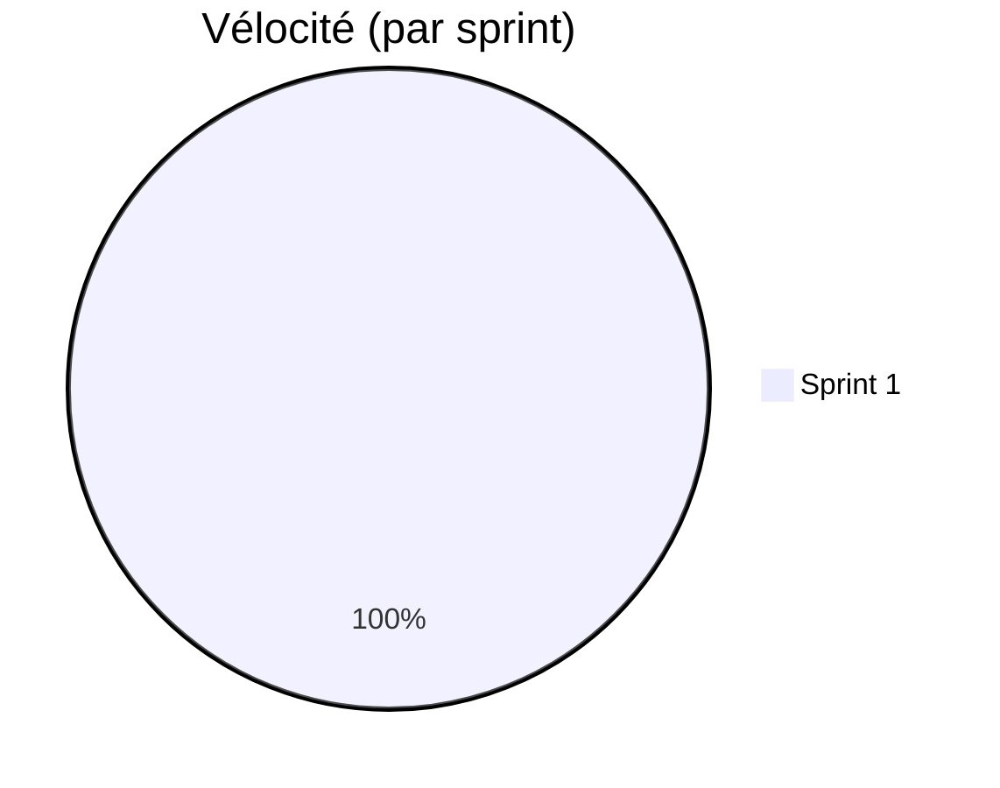
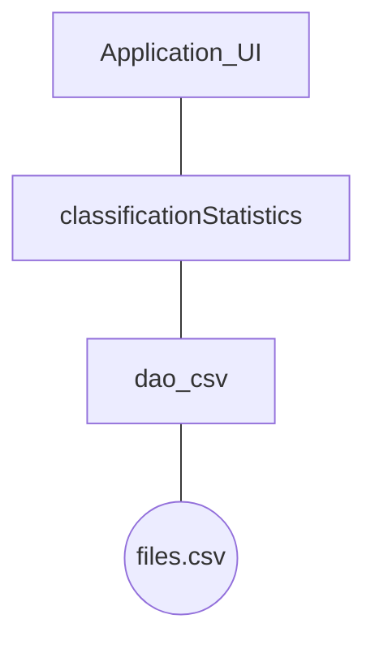

# Projet Analyse Numérique

## Introduction 

Le but de ce projet est de créer une librairie capable d'identifier le type d'activité d'un utilisateur en se basant sur des données captées sur son appareil mobile. 

Le projet se déroule en 3 phases:

* Phase 1 : Récolte de données (fichiers fournis

  Cette phase à consiste en une récolte d'informations. Elle à déjà été effectuée et les fichiers sont disponibles au format .CSV

* Phase 2 : Modélisation

  Sur base des données obtenues dans la phase 1, Nous établirons un « pattern » pour chaque type d’activité. Nous créerons donc, une librairie « classificationStatistics » décrite ci-dessous.

* Phase 3 : Création de l'application

  Création de l'application capable de classer les activités. 

> Explication des fichiers: 
>
> dws = (downstairs)--> une action 
>
> pour chaque action, il y a un fichier contenant les résultats obtenus pour chaque un des 24 sujets de tests

## Organisation

Le projet sera géré par la méthode de gestion de projet Scrum. (Les dates ci-dessous sont indicatives)

### Délivrables

Pour chaque Sprint, ce document sera mis à jour indiquant les avancement de l'équipe.

Le code est quand à lui disponible sur GitHub au lien suivant : https://github.com/Twan0u/Projet-IDI

### Vélocité

La vélocité est la mesure de la capacité d'un groupe à réaliser des tâches. Chaque tâche obtiens un poids directement lié à sa complexité et au temps nécessaire à sa réalisation. (Le poids d'une tâche est subjectif au groupe)

## Interfaces

XXXXXXXXXXXXX

## Modélisation

## Premier Sprint (16/03/20-20/03/20)

L'objectif de ce premier sprint sera la mise en place des bases nécessaires à la réalisation du projet. Ces bases se composent d'une analyse des besoins, l'identification des interfaces nécessaires à la réalisation du projet, ainsi qu'une ébauche de la structure générale du projet. 

##### Les tâches effectuées dans ce premier sprint sont : 

* Mise en place (Antoine) - 16/03 - vélocité 1
* Préparation des Délivrables (Antoine) - 16/03 - vélocité 1

##### Les tâches à effectuer dans le prochain sprint sont : 

* 

##### Rétrospective sur le sprint

###### Ce qui à été

* Interaction au sein du groupe agréables
* facilité de trouver des horaires pour travailler en groupe

###### Ce qui pourrait être amélioré

* 

###### Vélocité du groupe

La vélocité du groupe est de **XX points**.

## Deuxième Sprint (Date 2-Date 3)

##### Les tâches effectuées dans ce premier sprint sont : 

* 

##### Les tâches à effectuer dans le prochain sprint sont : 

* 

##### Rétrospective sur le sprint

###### Ce qui à été

* 

###### Ce qui pourrait être amélioré

* 

###### Vélocité du groupe

La vélocité du groupe est de **XX points**.

