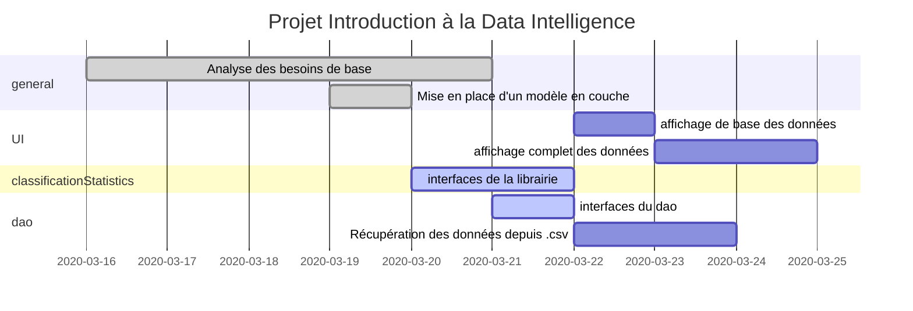
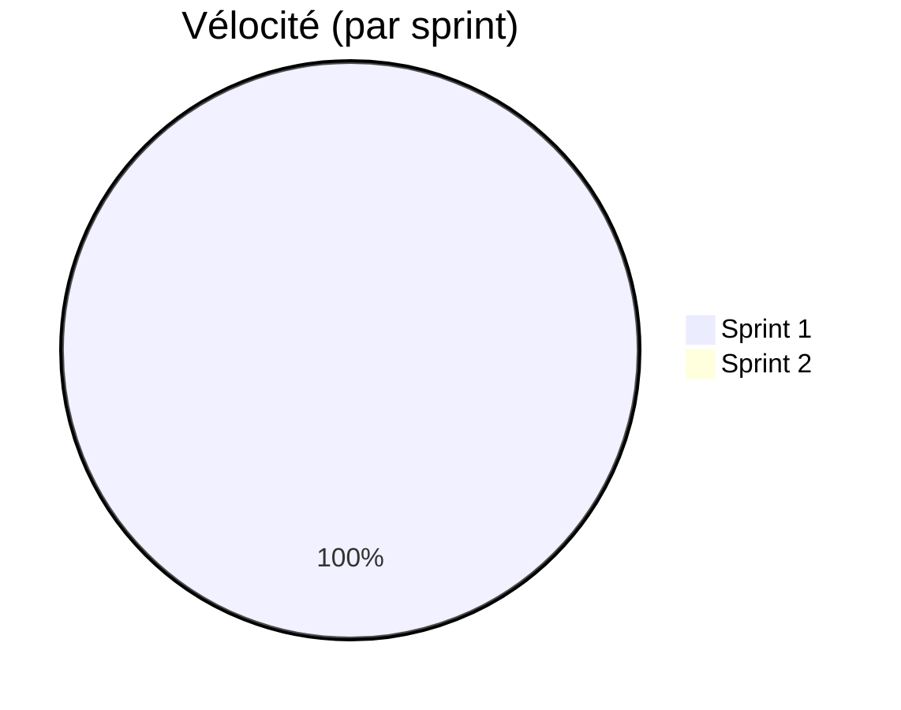
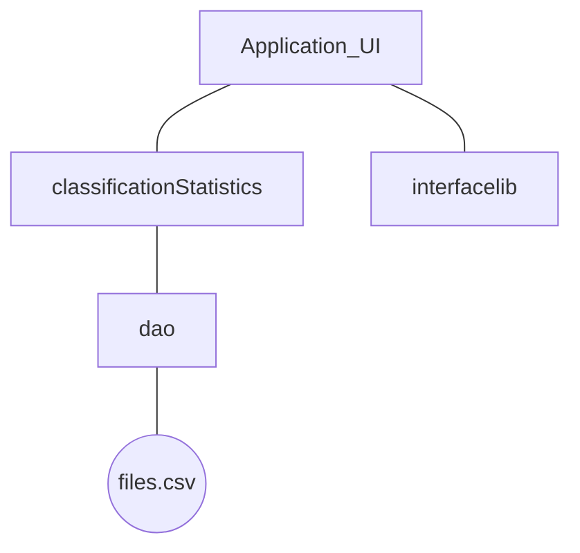

# Projet Analyse Numérique

## Introduction 

Le but de ce projet est de créer une librairie capable d'identifier le type d'activité d'un utilisateur en se basant sur des données captées sur son appareil mobile. 

Le projet se déroule en 3 pzhases:

* Phase 1 : Récolte de données (fichiers fournis)

  Cette phase à consiste en une récolte d'informations. Elle à déjà été effectuée et les fichiers sont disponibles au format .CSV

* Phase 2 : Modélisation

  Sur base des données obtenues dans la phase 1, Nous établirons un « pattern » pour chaque type d’activité. Nous créerons donc, une librairie « classificationStatistics » décrite ci-dessous.

* Phase 3 : Création de l'application

  Création de l'application capable de classer les activités. 

## Organisation

Le projet sera géré par la méthode de gestion de projet Scrum. (Les dates ci-dessous sont indicatives)



### Délivrables

Pour chaque Sprint, ce document sera mis à jour indiquant les avancement de l'équipe.

Le code est quand à lui disponible sur GitHub au lien suivant :

*  https://github.com/Twan0u/Projet-IDI

L'état actuel d'avancement du projet peut être observé via le tableau scrum Trello disponible à l'adresse suivante: 

* https://trello.com/b/zcFn5wpa/projet-idi

### Vélocité

La vélocité est la mesure de la capacité d'un groupe à réaliser des tâches. Chaque tâche obtiens un poids directement lié à sa complexité et au temps nécessaire à sa réalisation. (Le poids d'une tâche est subjectif au groupe)




## Interfaces

### Affichage des résultats par classes


### Affichage du diagramme en bâtons


## Modélisation

### Lien entre les classes



### Librairie classificationStatistics

```c
/* Crée un tableau reprenant les classes différentes et de connaître le nombre de classes.
 *  @param realClasses est un vecteur de classes
 *  @return une structure de donnée contenant un tableau avec les classes différentes et leur nombre.
 * */
struct Classes researchClasses(String[] realClasses);

/*  Crée un tableau reprenant la classes (cfr interface1 - document de projet), les bien classes un total et un calcul du pourcentage de bien classes
 *  @param realclasses est un vecteur de classes
 *  @return void 
 * */
void displayResultsForEachClasses();

/* fonction permettant l'affichage de l'accuracy ex:"L’accuracy est de 78%"
 *  @param realClasses est un vecteur de classes concrètes
 *  @param estimateClasses est un vecteur de classes estimées par le programme
 *  @return void 
 * */
void displayAccuracy(String [] realclasses, String[] estimateClasses)

/* crée un graphique à bars (cfr interface 2 - document de projet)
 *  @params TODO
 *  @return void
 * */
void displayBarChart();
```

D'autres classes sont susceptibles d'apparaitre en cours de projet pour satisfaire les besoins éventuels du projet et sa mise en œuvre.

## Premier Sprint (16/03/20-20/03/20)

L'objectif de ce premier sprint sera la mise en place des bases nécessaires à la réalisation du projet. Ces bases se composent d'une analyse des besoins, l'identification des interfaces nécessaires à la réalisation du projet, ainsi qu'une ébauche de la structure générale du projet. 

##### Les tâches effectuées dans ce sprint sont : 

* Mise en place (Antoine) - 16/03 - vélocité 1
* Mise en place d'un modèle en couche avec interfaces (Antoine) - 19/03 - vélocité 1
* Analyse de base pour le projet (Antoine & Arnaud) - 17/03 au 20/03 - vélocité 3

##### Les tâches à effectuer dans le prochain sprint sont : 

* Coder les fonctions de base et créer des tests unitaires pour ceux-ci
* programmer les interfaces

##### Rétrospective sur le sprint

###### Ce qui à été

* Interaction au sein du groupe agréables
* Facilité de trouver des horaires pour travailler en groupe
* Facilité dans le pair programming 

###### Ce qui pourrait être amélioré

* Améliorer la vélocité de l'équipe (>5)
* écrire les fonctions de base analysée dans le premier sprint
* écrire des tests unitaires automatisées pour tester les fonctions décrites ci-dessus

###### Vélocité du groupe

La vélocité du groupe est de **5 points**.

## Deuxième Sprint (21/03/20-27/03/20)


##### Les tâches effectuées dans ce sprint sont : 

* 

##### Les tâches à effectuer dans le prochain sprint sont : 

* 

##### Rétrospective sur le sprint

###### Ce qui à été

* 

###### Ce qui pourrait être amélioré

* 

###### Vélocité du groupe

La vélocité du groupe est de **XX points**.


