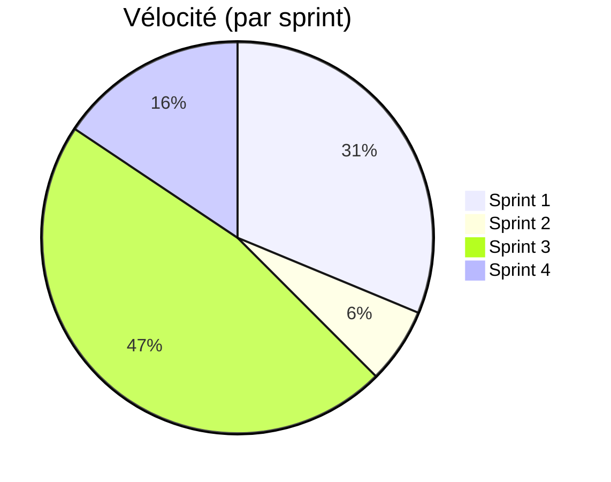
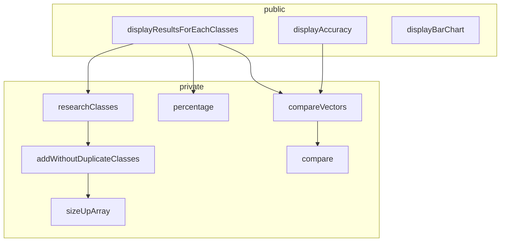

# Projet Analyse Numérique

## Introduction 

Le but de ce projet est de créer une librairie capable d'identifier le type d'activité d'un utilisateur en se basant sur des données captées sur son appareil mobile. 

Le projet se déroule en 3 phases:

* Phase 1 : Récolte de données (fichiers fournis)

  Cette phase à consiste en une récolte d'informations. Elle à déjà été effectuée et les fichiers sont disponibles au format .CSV

* Phase 2 : Modélisation

  Sur base des données obtenues dans la phase 1, Nous établirons un « pattern » pour chaque type d’activité. Nous créerons donc, une librairie « classificationStatistics » décrite ci-dessous.

* Phase 3 : Création de l'application

  Création de l'application capable de classer les activités. 

## Organisation

Le projet sera géré par la méthode de gestion de projet Scrum. 

### Délivrables

Pour chaque Sprint, ce document sera mis à jour indiquant les avancement de l'équipe.

Le code est quand à lui disponible sur GitHub au lien suivant :

*  https://github.com/Twan0u/Projet-IDI

L'état actuel d'avancement du projet peut être observé via le tableau scrum Trello disponible à l'adresse suivante: 

* https://trello.com/b/zcFn5wpa/projet-idi

### Vélocité

La vélocité est la mesure de la capacité d'un groupe à réaliser des tâches. Chaque tâche obtiens un poids directement lié à sa complexité et/ou au temps nécessaire à sa réalisation. (Le poids d'une tâche est subjectif au groupe)




## Interfaces

### Affichage des résultats par classes


### Affichage du diagramme en bâtons


## Modélisation

### Librairie classificationStatistics



#### Fonction:  researchClasses()

```c
/* 	Crée un tableau reprenant les classes différentes que contiens realClasses et supprime les doublons.
 *
 *  @param 	realClasses est un vecteur contenant de une série de classes
 *
 *  @return une structure de donnée contenant un tableau avec les classes individuellement différentes et le nombre total de classes individuellement différentes disponibles.
 */
Classes researchClasses(int* realClasses, int realClassesSize)
```


#### Fonction : addWithoutDuplicateClasses

```c
/* Ajoute à la structure Classes un élément si celui-ci n'existe pas déjà dedans. Cette fonction incrémentera ensuite le compteur de classes de 1 si elle à ajouté un élément
 *
 * @param classes est une structure contenant un tableau et la taille de celui-ci. Il est utilisé pour stocker les différentes classes individuellement différentes
 * @param newItem est le nouvel élément à ajouter à classes
 *
 * @return la structure classes entrée en paramètre d'entrée à laquelle on doit ou non ajouter newItem si celui-ci n'était pas déjà présent. cette structure aura son compteur size augmenté de 1 si un élément à été ajouté
*/
Classes addWithoutDuplicateClasses(Classes classes, int newItem);
```


#### Fonction : sizeUpArray

```c
/* Prends le tableau oldArray et le copie dans un nouveau tableau qui mesure une unité de plus que oldArray
 *
 * @param oldArray ancien tableau que l'on souhaite agrandir et copier
 * @param newArray nouveau tableau de taille sizeOldArray +1 dans lequel on va copier les données de l'ancien
 * @param sizeOldArray taille de l'ancien tableau oldArray
 *
 */
void sizeUpArray(int* oldArray,int* newArray, int sizeOldArray)
```


#### Structure: Classes

```c
/* Contiens un tableau de classes et la taille de ce tableau
 *
 * vector est un tableau contenant des entiers
 * size est la taille de ce tableau
 */
typedef struct Classes Classes;
struct Classes {
    int *vector;
    int size;
};
```


#### Fonction: compare()

```c
/*	Compare 2 entiers et vérifie que ceux-ci sont identiques
 *
 *	@param firstElement premier entier à comparer
 *	@param secondElement second entier à comparer
 *
 *	@return 0 si les 2 éléments sont identiques et autre chose sinon
 */
int compare(int firstElement, int secondElement);
```


#### Fonction: compareVectors()

```c
/*	Compare 2 vecteurs entre eux et retourne un tableau de taille identique au premier vecteur mis en paramètre. Si l'élément du tableau vaut 0, cela signifie que les 2 vecteurs ont le même contenu.
 *
 *	@param realClasses est le premier vecteur a comparer
 *  @param estimateClasses est un second vecteur qui sera comparé au premier
 *
 *  @return un tableau d'entier de même taille que realClasses qui contiens un 0 quand les 2 éléments du tableau sont identiques et autre chose quand ils sont différents
 */
int *compareVectors(int *realClasses, int *estimateClasses);
```


#### Fonction: displayResultsForEachClasses()

```c
/*  Affiche un tableau reprenant les différentes classes disponibles (cfr interface1 - document de projet), combien ont bien été classées dans estimateClasses, le nombre d'occurences de chaque classe dans vecteur realClasses et un pourcentage de classes qui ont bien été classées dans estimateClasses.
 *
 *  @param realclasses est un vecteur de classes
 *
 *  @return void
 */
void displayResultsForEachClasses(int *realClasses, int *estimateClasses);
```


#### Fonction displayAccuracy()

```c
/* 	Affiche la précision de l'estimation faite par estimateClasses sur le vecteur realclasses et l'affiche sous la forme suivante "L’accuracy est de XX%".
 *
 *  @param realClasses est un vecteur de classes concrètes
 *  @param estimateClasses est un vecteur de classes estimées par le programme
 *
 *  @return void
 */
void displayAccuracy(int *realclasses, int *estimateClasses);
```


#### Fonction Percentage()

```c
/* retourne le calcul d'un pourcentage de ( sum / total ) * 100
 *
 * @param sum est le nombre de réalisation
 * @param total est le nombre d'essais
 *
 * @return un pourcentage. Si sum est suppérieur à total, retourne 100.
 */
double percentage(int sum, int total);
```


-------

#### Fonction displayBarChart()

```c
/* 	crée un graphique à bars (cfr interface 2 - document de projet)
 *  @params TODO
 *  @return void
 */
void displayBarChart();
```


> D'autres classes sont susceptibles d'apparaitre en cours de projet pour satisfaire les besoins éventuels du projet et sa mise en œuvre.


## Premier Sprint (16/03/20-20/03/20)

L'objectif de ce premier sprint sera la mise en place des bases nécessaires à la réalisation du projet. Ces bases se composent d'une analyse des besoins, l'identification des interfaces nécessaires à la réalisation du projet, ainsi qu'une ébauche de la structure générale du projet. 

##### Les tâches effectuées dans ce sprint sont : 

* Mise en place (Antoine) - 16/03 - vélocité 1
* Mise en place d'un modèle en couche avec interfaces (Antoine) - 19/03 - vélocité 1
* Analyse de base pour le projet (Antoine & Arnaud) - 17/03 au 20/03 - vélocité 3

##### Les tâches à effectuer dans le prochain sprint sont : 

* Coder les fonctions de base et créer des tests unitaires pour ceux-ci
* programmer les interfaces

##### Rétrospective sur le sprint

###### Ce qui à été

* Interaction au sein du groupe agréables
* Facilité de trouver des horaires pour travailler en groupe
* Facilité dans le pair programming 

###### Ce qui pourrait être amélioré

* Améliorer la vélocité de l'équipe (>5)
* écrire les fonctions de base analysée dans le premier sprint
* écrire des tests unitaires automatisées pour tester les fonctions décrites ci-dessus

###### Vélocité du groupe

La vélocité du groupe est de **5 points**.


## Deuxième Sprint (21/03/20-27/03/20)

##### Les tâches effectuées dans ce sprint sont : 

* Continuer l'analyse des besoins (Arnaud & Antoine)- 26/03 - vélocité 1

##### Les tâches à effectuer dans le prochain sprint sont : 

* Mise en Ordre aux conformités exigées par le professeur
* Mettre en place de tests unitaires

##### Rétrospective sur le sprint

###### Ce qui à été

* Travail au sein du groupe

###### Ce qui pourrait être amélioré

* Coordination et mise en place de deadlines internes au groupe
* Vélocité (quantité de travail effectuée)

###### Vélocité du groupe

La vélocité du groupe est de **1 point**.


## Troisième Sprint (28/03/20-03/04/20)

##### Les tâches effectuées dans ce sprint sont : 

* DA à remettre pour le cours du lundi (Arnaud) - 30/03 - Vélocité 3

* Mise en ordre des analyses du sprint 1(Antoine) - 30/03 au 31/03 - vélocité 1
* Test de la fonction compare() (Antoine) - 31/03 - vélocité 1
* coder la fonction compare() (Antoine) - 31/03 - vélocité 0,5
* coder la fonction percentage() (Antoine) - 31/03 - vélocité 1
* test de la fonction percentage() (Antoine) - 31/03 - vélocité 1

##### Les tâches à effectuer dans le prochain sprint sont : 

* 

##### Rétrospective sur le sprint

###### Ce qui à été

* 

###### Ce qui pourrait être amélioré

* 

###### Vélocité du groupe

La vélocité du groupe est de **6.5 points**.


## Quatrième Sprint (04/04/20-19/04/20)

##### Les tâches effectuées dans ce sprint sont : 

* Implémentation de researchClasses() (Antoine) - 19/04 - vélocité 0,5
* Implémentation de addWithoutDuplicateClasses() (Antoine) - 19/04 - vélocité 1,5
* Implémentation de sizeUpArray() (Antoine) - 19/04 - vélocité 0,5
* Implémentation de DisplayAccuracy() (Antoine) - 19/04 - vélocité 0,5

##### Les tâches à effectuer dans le prochain sprint sont : s

* 

##### Rétrospective sur le sprint

###### Ce qui à été

* 

###### Ce qui pourrait être amélioré

* 

###### Vélocité du groupe

La vélocité du groupe est de **2,5 points**.


