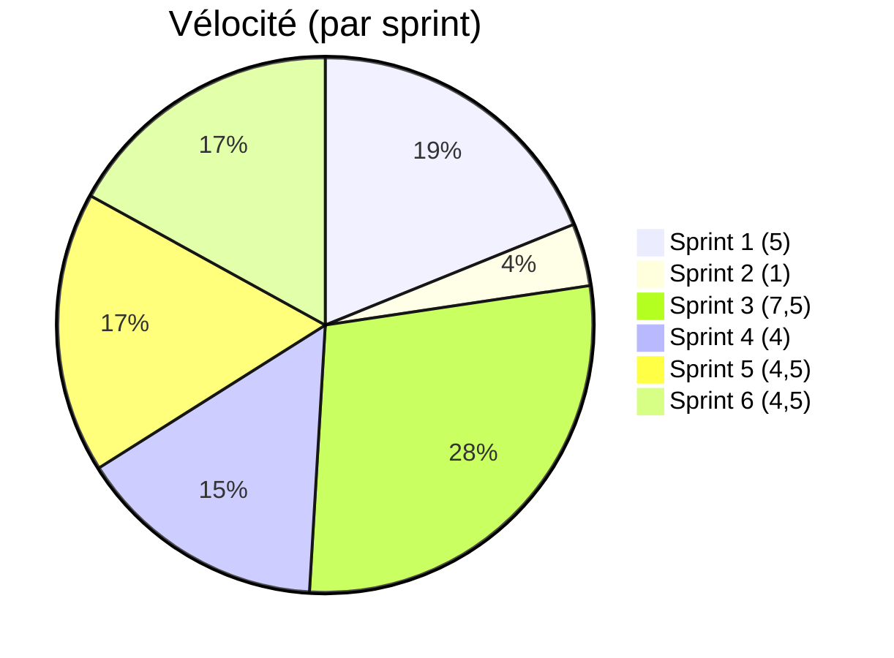
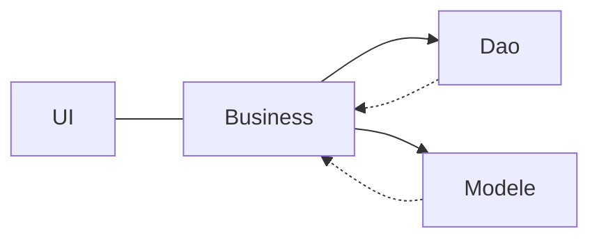
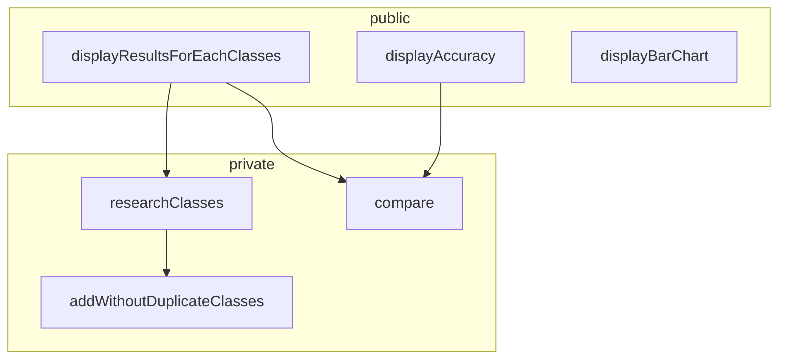

# Projet Analyse Numérique

## Introduction 

Le but de ce projet est de créer une librairie capable d'identifier le type d'activité d'un utilisateur en se basant sur des données captées sur son appareil mobile. 

Le projet se déroule en 3 phases:

* Phase 1 : Récolte de données (fichiers fournis)

  Cette phase à consiste en une récolte d'informations. Elle à déjà été effectuée et les fichiers sont disponibles au format .CSV

* Phase 2 : Modélisation

  Sur base des données obtenues dans la phase 1, Nous établirons un « pattern » pour chaque type d’activité. Nous créerons donc, une librairie « classificationStatistics » décrite ci-dessous.

* Phase 3 : Création de l'application

  Création de l'application capable de classer les activités. 

## Organisation

Le projet sera géré par la méthode de gestion de projet Scrum. 

### Délivrables

Pour chaque Sprint, ce document sera mis à jour indiquant les avancement de l'équipe.

Le code est quand à lui disponible sur GitHub au lien suivant :

*  https://github.com/Twan0u/Projet-IDI

L'état actuel d'avancement du projet peut être observé via le tableau scrum Trello disponible à l'adresse suivante: 

* https://trello.com/b/zcFn5wpa/projet-idi

### Vélocité

La vélocité est la mesure de la capacité d'un groupe à réaliser des tâches. Chaque tâche obtiens un poids directement lié à sa complexité et/ou au temps nécessaire à sa réalisation. (Le poids d'une tâche est plus ou moins équivalent à 1h)




## Interfaces

### Affichage des résultats par classes


### Affichage du diagramme en bâtons


## Modélisation

### Modélisation générale1



Ce programme se compose de 4 modules. L'**UI** est la partie responsable des interactions avec l'utilisateur.  La partie **Business** est quand à elle responsable des traitements. Elle fera donc appel à la partie **Dao** pour extraire et formater les données issues (dans ce cas-ci) de fichiers CSV. La dernière partie concerne La manière d'analyser les données. Il peut être utile d'analyser les données reçues au moyen de différents algorithmes pour obtenir de meilleurs résultats d'analyse. Voilà le travail de la partie **Modele** qui peut être changée pour accueillir un autre algorithme plus performant.

###  Librairie classificationStatistics




#### Fonction:  researchClasses()

```c
/* 	Crée un tableau reprenant les classes différentes que contiens realClasses et supprime les doublons.
 *
 *  @param realClasses est un tableau contenant de les classes existantes
 *
 *  @return un le nombre de classe différentes existant
 */
int researchClasses(int* realClasses, int realClassesSize)
```


#### Fonction : addWithoutDuplicateClasses

```c
/*
*
*/
int addWithoutDuplicateClasses(Classes classes, int newItem);
```


#### Fonction: compare()

```c
/*
*
*/
void compare(int* malClasse,int* realClasses,int* estimateClasses,int nbRealClasse)
```


#### Fonction: displayResultsForEachClasses()

```c
/*  Affiche un tableau reprenant les différentes classes disponibles (cfr interface1 - document de projet), combien ont bien été classées dans estimateClasses, le nombre d'occurences de chaque classe dans vecteur realClasses et un pourcentage de classes qui ont bien été classées dans estimateClasses.
 *
 *  @param realclasses est un tableau de vecteur
 *
 *  @return void
 */
void displayResultsForEachClasses( int *realClasses, int* estimateClasses,int nbRealClasse)
```


#### Fonction displayAccuracy()

```c
/* 	Affiche la précision de l'estimation faite par estimateClasses sur le vecteur realclasses et l'affiche sous la forme suivante "L’accuracy est de XX%".
 *
 *  @param realClasses est un vecteur de classes concrètes
 *  @param estimateClasses est un vecteur de classes estimées par le programme
 *  @param sizeOfRealClasses est la taille du vecteur realClasses
 *
 *  @return void
 */
void displayAccuracy(int *realClasses, int *estimateClasses, int sizeOfRealClasses)
```


#### Fonction generateClasses

```c
/*
*
*/
void generateClasses(double** classes, int* realClasses, int* estimateClasses, double** patterns, int nbRealClasse,char ** category)
```


#### Fonction displayScale()

```c
/* crée une échelle  pour le graphique à barre
 * @params scale est l'échelle  = nombre d'élements total/50
 * @return void
 */
void displayScale(int scale)
```


#### Fonction displayBarChart()

```c
/* 	crée un graphique à bars (cfr interface 2 - document de projet)
 *  @params realClasses
 *  @params estimateClasses
 *  @params nbRealClasse
 *  @return void
 */
void displayBarChart(int* realClasses, int* estimateClasses, int nbRealClasse)
```

> D'autres classes sont susceptibles d'apparaitre en cours de projet pour satisfaire les besoins éventuels du projet et sa mise en œuvre.


## Choix d'implémentations (et optimisations)

A plusieurs endroits du projet, nous avons utilisés de larges tableaux pour transférer les données. Il serait possible de gagner des performances en éliminant ces écritures et lectures inutiles mais cette implémentation à été volontairement effectuée pour permettre une plus grande souplesse dans l'implémentation de la couche d'accès aux données et de permettre si besoin est de changer de moyen de stockage (fichier binaire ou encore base de donnée)


## Premier Sprint (16/03/20-20/03/20)

L'objectif de ce premier sprint sera la mise en place des bases nécessaires à la réalisation du projet. Ces bases se composent d'une analyse des besoins, l'identification des interfaces nécessaires à la réalisation du projet, ainsi qu'une ébauche de la structure générale du projet. 

##### Les tâches effectuées dans ce sprint sont : 

* Mise en place (Antoine) - 16/03 - vélocité 1
* Mise en place d'un modèle en couche avec interfaces (Antoine) - 19/03 - vélocité 1
* Analyse de base pour le projet (Antoine & Arnaud) - 17/03 au 20/03 - vélocité 3

##### Les tâches à effectuer dans le prochain sprint sont : 

* Coder les fonctions de base et créer des tests unitaires pour ceux-ci
* programmer les interfaces

##### Rétrospective sur le sprint

###### Ce qui à été

* Interaction au sein du groupe agréables
* Facilité de trouver des horaires pour travailler en groupe
* Facilité dans le pair programming 

###### Ce qui pourrait être amélioré

* Améliorer la vélocité de l'équipe (>5)
* écrire les fonctions de base analysée dans le premier sprint
* écrire des tests unitaires automatisées pour tester les fonctions décrites ci-dessus

###### Vélocité du groupe

La vélocité du groupe est de **5 points**.


## Deuxième Sprint (21/03/20-27/03/20)

##### Les tâches effectuées dans ce sprint sont : 

* Continuer l'analyse des besoins (Arnaud & Antoine)- 26/03 - vélocité 1

##### Les tâches à effectuer dans le prochain sprint sont : 

* Mise en Ordre aux conformités exigées par le professeur
* Mettre en place de tests unitaires

##### Rétrospective sur le sprint

###### Ce qui à été

* Travail au sein du groupe

###### Ce qui pourrait être amélioré

* Coordination et mise en place de deadlines internes au groupe
* Vélocité (quantité de travail effectuée)

###### Vélocité du groupe

La vélocité du groupe est de **1 point**.


## Troisième Sprint (28/03/20-03/04/20)

##### Les tâches effectuées dans ce sprint sont : 

* DA à remettre pour le cours du lundi (Arnaud) - 30/03 - Vélocité 3

* Mise en ordre des analyses du sprint 1(Antoine) - 30/03 au 31/03 - vélocité 1
* Test de la fonction compare() (Antoine) - 31/03 - vélocité 1
* coder la fonction compare() (Antoine) - 31/03 - vélocité 0,5
* coder la fonction percentage() (Antoine) - 31/03 - vélocité 1
* test de la fonction percentage() (Antoine) - 31/03 - vélocité 1

###### Vélocité du groupe

La vélocité du groupe est de **7.5 points**.


## Quatrième Sprint (04/04/20-19/04/20)

##### Les tâches effectuées dans ce sprint sont : 

* Implémentation de researchClasses() (Antoine) - 19/04 - vélocité 0,5
* Implémentation de addWithoutDuplicateClasses() (Antoine) - 19/04 - vélocité 1,5
* Implémentation de sizeUpArray() (Antoine) - 19/04 - vélocité 0,5
* Implémentation de DisplayAccuracy() (Antoine) - 19/04 - vélocité 0,5
* Implémentation d'affichage du graphique en bars (Arnaud)-19/04 - Vélocité 1

###### Vélocité du groupe

La vélocité du groupe est de **4 points**.

## Cinquième Sprint (20/04/20-20/05/20)

##### Les tâches effectuées dans ce sprint sont : 

* Implémentation de researchClasses() (Antoine) - 19/04 - vélocité 0,5
* Afficher et lister les fichiers contenus dans un répertoire (Antoine) - 25/04 - Vélocité 3
* Lire les données issues d'un fichier CSV (Antoine) - 30/04 - Vélocité 3
* Ecrire les données dans un fichier CSV (Antoine) - 10/05 - Vélocité 3

###### Note

Une personne du groupe est tombé malade ce qui à négativement impacté les performances pour ce sprint

###### Vélocité du groupe

La vélocité du groupe est de **9,5 points**.

## Sixième Sprint (20/05/20-5/06/20)

##### Les tâches effectuées dans ce sprint sont : 

* Génération des patterns (Arnaud) - 04/06 - vélocité 0,5
* Fonction de distance euclidienne - 04/06 - vélocité 1
* Mise en place Classification Statistics - 04/06 - Vélocité 3

##### Les tâches à effectuer dans le prochain sprint sont : 

* 

##### Rétrospective sur le sprint

###### Ce qui à été

* Pas de tension au sein du groupe 
* disponibilité de l'équipe

###### Ce qui pourrait être amélioré

* retard pris sur les deadlines
* Manque de coordination dans le travail

###### Vélocité du groupe

La vélocité du groupe est de **4,5 points**.


