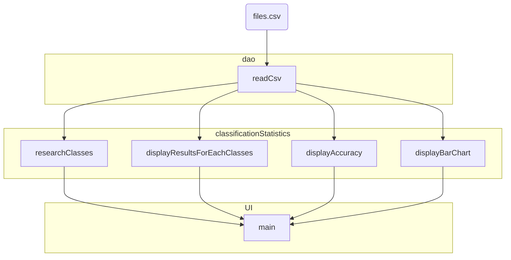

temp 

```c
#include <stdio.h>

int main(void) {
    FILE *fp = fopen("sample.csv", "r");
    char buf[1024];

    if (!fp) {
        printf("Can't open file\n");
        return 1;
    }

    while (fgets(buf, 1024, fp)) {
        printf("%s\n", buf);
    }

    fclose(fp);

    return 0;
}
```



